## Subscription-Based Content API
- A robust FastAPI backend developed for the GDG recruitment process. This platform manages user subscriptions, enforces a premium content paywall, and provides admin-level analytics via CSV reports.

## Tech Stack
- Framework: FastAPI (Python)
- Database: PostgreSQL
- Authentication: OAuth2 with JWT Bearer Tokens
- Environment: Docker & Docker Compose

## Features Implemented
- Role-Based Access Control: Distinct 'Free' and 'Premium' user tiers.
- Premium Paywall: Custom middleware to protect sensitive endpoints.
- Subscription Management: Simulated payment logic for instant account upgrades.
- 30-Day Expiration: Logic to automatically revoke premium status after 30 days.
- Activity Logging: Database logging for every premium content access.
- Admin Reporting: Secure endpoint to download usage logs as a CSV file.

---

## 📸 Application Screenshots

### 🖥️ API Documentation (Swagger UI)
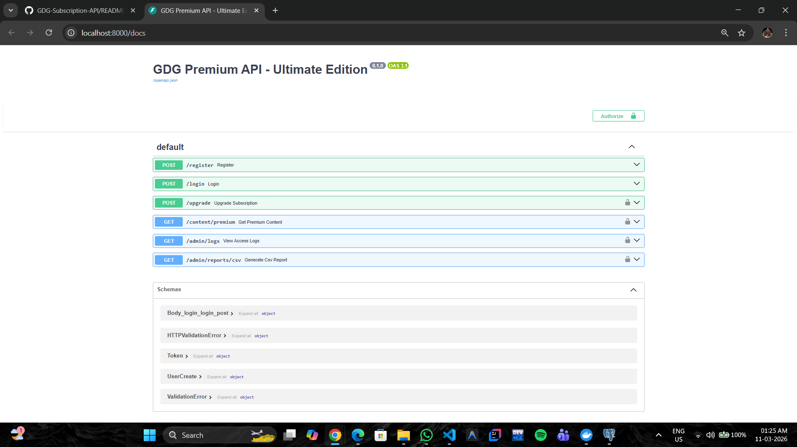

### 🔐 Authentication & Security
**User Registration & JWT Token Generation**
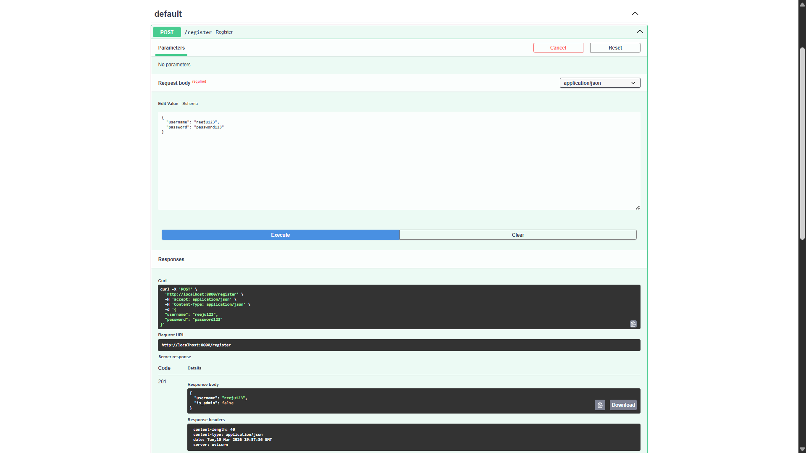
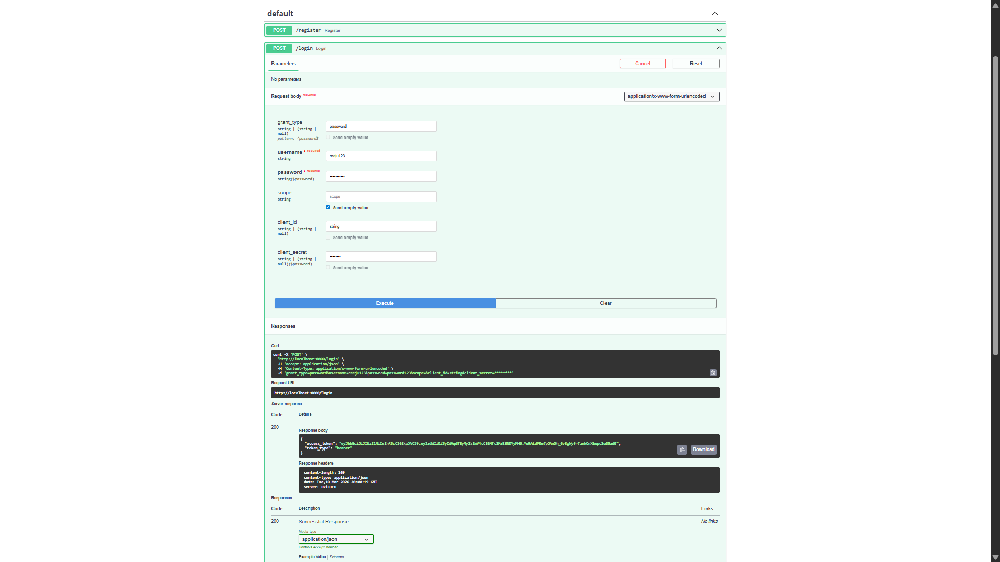
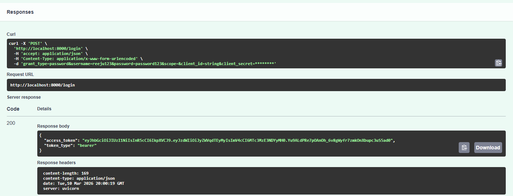
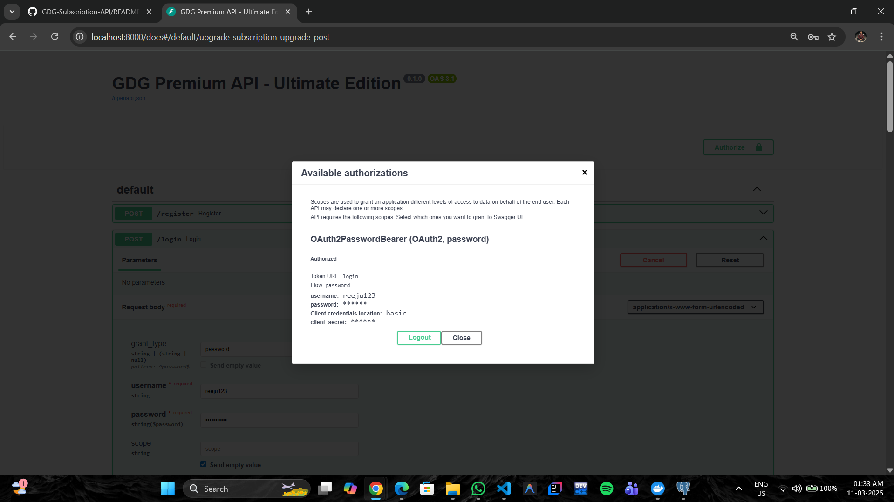

### 💳 Subscription & Paywall Logic
**Access Denied vs. Premium Access**
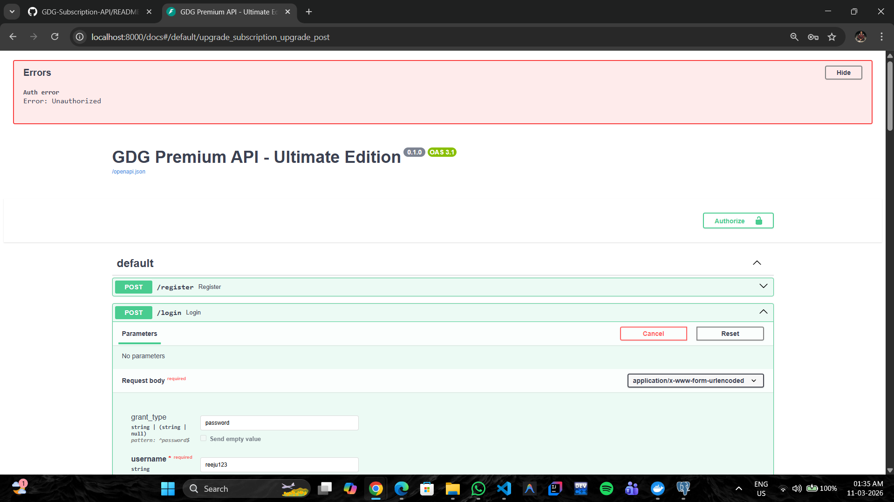
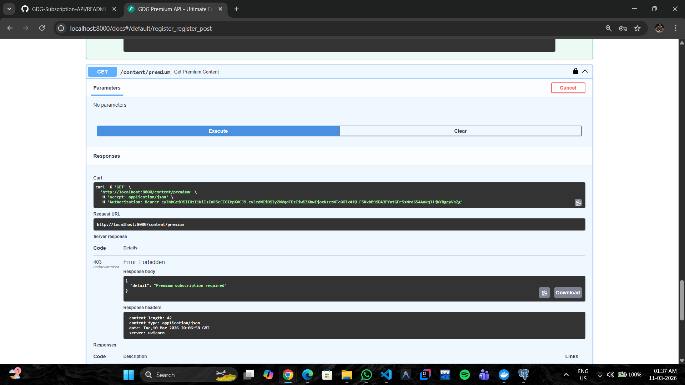
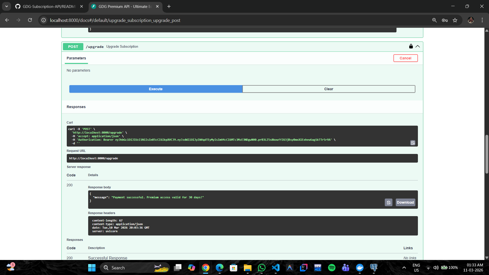
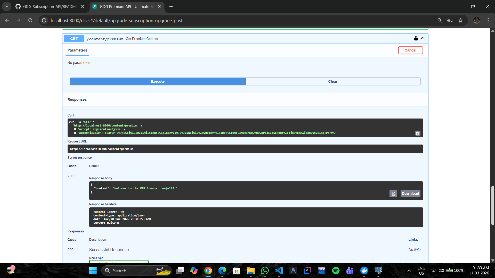

### 📊 Admin Analytics & Reporting
**Activity Logs & CSV Export Proof**
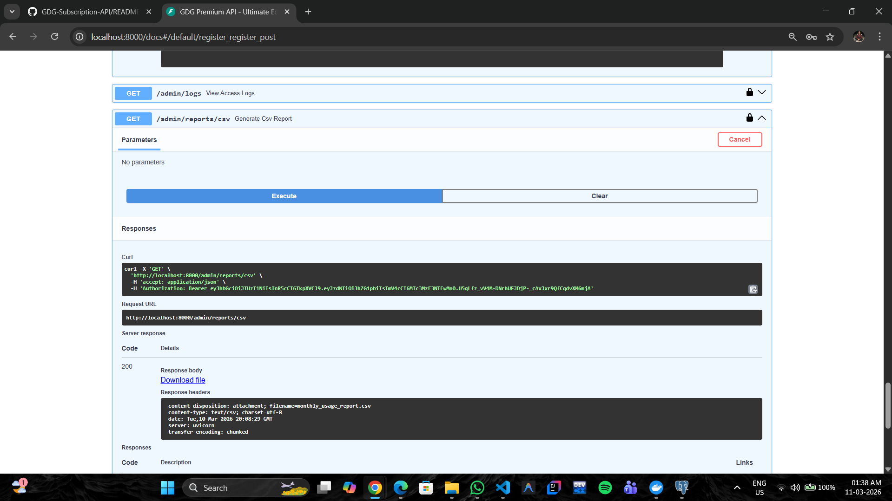
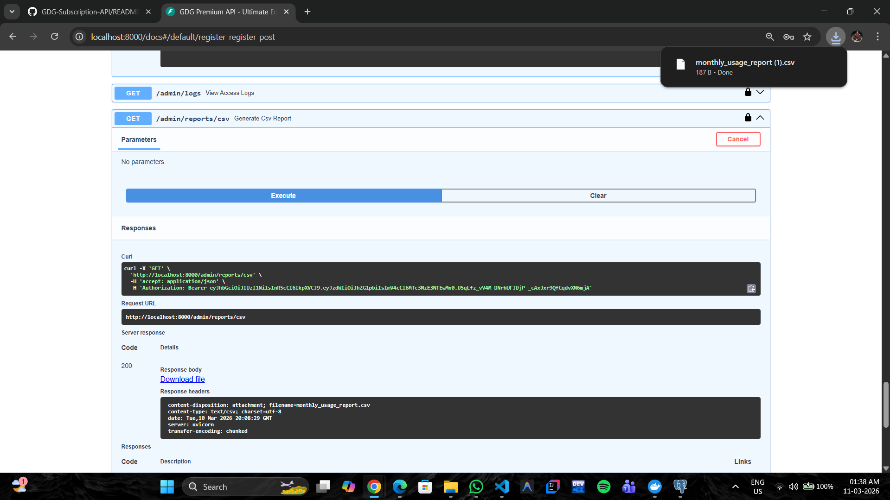

---

## How to Run Locally (Using Docker)
The application is fully containerized. To run the API and Database together:
- Ensure Docker Desktop is running.
- Open your terminal in the project root folder.
- Run:
```bash
docker-compose up --build
```

Access the interactive API documentation at:
http://localhost:8000/docs

## Manual Setup (Optional)
If you prefer to run it without Docker:
- Create a virtual environment: python -m venv venv
- Activate it: .\venv\Scripts\activate
- Install dependencies: pip install -r requirements.txt
- Configure your .env with a local PostgreSQL URL.
- Start the server:
  ```
  uvicorn main:app --reload
  ```

## Example API Requests
Follow these steps in the Swagger UI (/docs) to test the system:

1. Register a User
POST /register
```json
{
"username": "reeju",
"password": "password123"
}
```
2. Login & Authenticate
- POST /login
Use the 'Try it out' button.
Enter the credentials created above.
- Tip: Copy the access_token or use the green Authorize button at the top of the page to lock in your session.

3. Upgrade to Premium
- POST /upgrade
- Click 'Execute' while authenticated.
This grants Premium status and sets a 30-day expiration date.

4. Access Protected Content
- GET /content/premium
- Premium Users: Receive a "Welcome to the VIP lounge" message.
- Free Users: Receive a 403 Forbidden error.

5. Admin Access & Security
- To test the administrative features, you must be logged in as an Admin user
- How to gain Admin status:
  Automatic Admin: Register a user with the exact username admin. The backend logic is configured to grant this user super-user privileges.
- Endpoints unlocked:
- GET /admin/logs: View a JSON list of every premium access event (User ID, Endpoint, IP Address, and Timestamp).
- GET /admin/reports/csv: Generates and downloads a live CSV report of all activity.

6. Admin Report (CSV)
- GET /admin/reports/csv
- Note: User must have the is_admin flag (Register with username admin for testing).
- Result: Downloads a monthly_usage_report.csv file.

## Project Structure
- main.py: Main application entry point and routes.
- models.py: SQLAlchemy database models.
- schemas.py: Pydantic models for request/response validation.
- database.py: Database engine and session configuration.
- Dockerfile & docker-compose.yml: Containerization configuration.
- .gitignore: Prevents sensitive and temporary files from being tracked.
